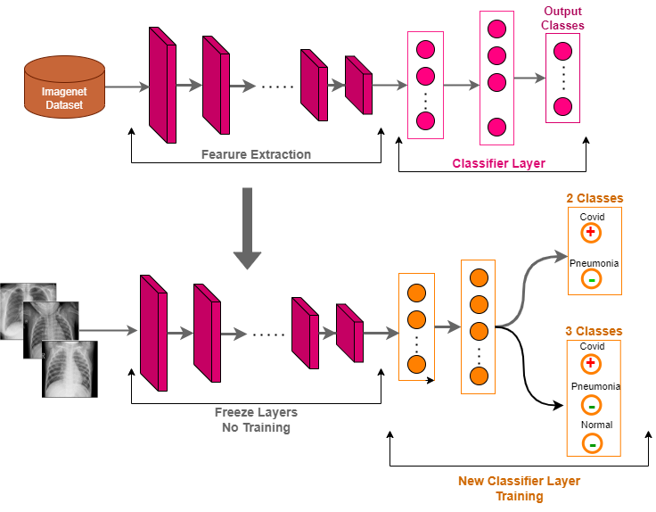

# Covid19-Detection

* This is an implementation of a course project conducted in June 2020 for the postgraduate course EC736-Neural Networks Applications.
* Code Implementation for binary classification (COVID-19 and pneumonia): [Covid_2Classes.ipynb](Covid_2Classes.ipynb)
* Code Implementation for multi-class classification, (COVID-19, pneumonia, and normal): [Covid_3Classes.ipynb](Covid_3Classes.ipynb)
* Additionally, A code implementation to the [kaggle](https://www.kaggle.com/paultimothymooney/chest-xray-pneumonia) dataset is located at: [Pneumonia-KaggleDataset.ipynb](Pneumonia-KaggleDataset.ipynb)

## Dataset
Dataset used in this repo can be accessed through this [link](https://drive.google.com/file/d/12nT-yTns2PAEZHf3B2XNL6V_nUfw-YHv/view)

A new chest X-ray dataset for COVID-19 detection was created by combining two existing datasets. First dataset from [kaggle](https://www.kaggle.com/paultimothymooney/chest-xray-pneumonia) consists of pneumonia and normal cases, while the second dataset from [Github](https://github.com/ieee8023/covid-chestxray-dataset) exclusively contains COVID-19 cases.
The constructed dataset facilitates the evaluation of models for two tasks: binary classification (COVID-19 and pneumonia) and multi-class classification, (COVID-19, pneumonia, and normal).

## Model Framework

## Results
| Model                | Binary-class Accuracy | Multi-class Accuracy |
| -------------------- | --------------------- |--------------------- |
| ResNet18             |        97.64%         |      85.71%          |
| Mobilenet_v2         |        98.43%         |      82.88%          |
| Shufflenet_v2        |        99.02%         |      85.04%          |
| Shufflenet+Mobilenet |        99.80%         |      84.77%          |
| Resnet18+Shufflenet  |        99.41%         |      88.01%          |

